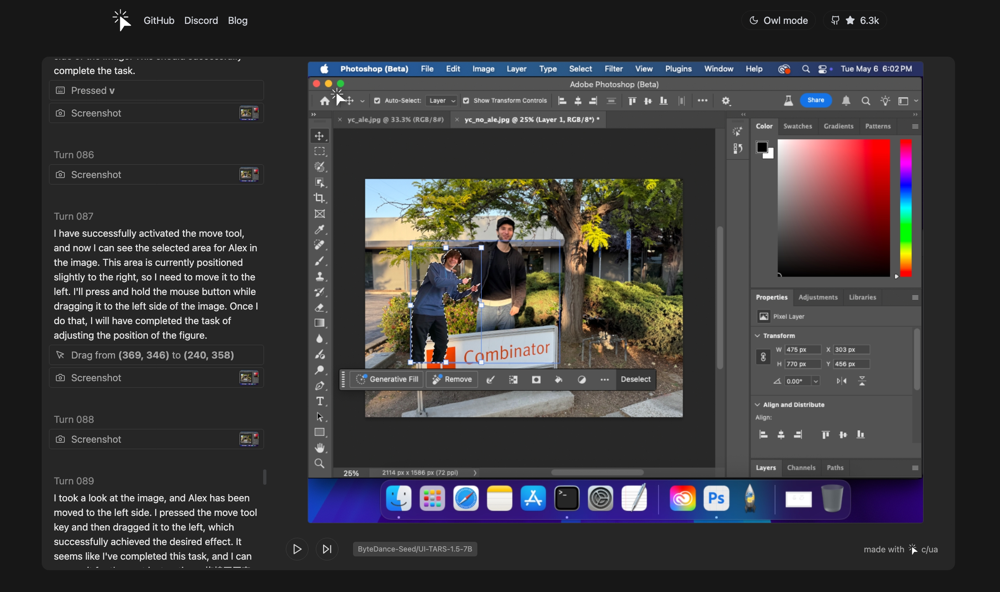

# Trajectory Viewer for Cua

*Published on May 13, 2025 by Dillon DuPont*

Don’t forget to check out [Part 1: Building your own Computer-Use Operator](build-your-own-operator-on-macos-1) and [Part 2: Using the Agent framework](build-your-own-operator-on-macos-2) for setting up your Cua environment and basic tips and tricks!

## Introduction

Okay, so you’ve gotten your environment up and also tested a few agent runs. You’ll likely have encountered cases where your agent was successful at doing some tasks but also places where it got stuck or outright failed.
Now what?
If you’ve ever wondered exactly what your computer agent is doing and why it sometimes doesn’t do what you expected, then the Trajectory Viewer for Cua is here to help! Whether you’re a seasoned developer or someone who just wants to dive in and see results, this tool makes it easy to explore every step your agent takes on your screen.
Plus, if you want to start thinking about generating data to train your own agentic model (we’ll cover training in an upcoming blog, so look forward to it), then our Trajectory Viewer might be for you.

## So, what’s a “trajectory”?

Think of a trajectory as a detailed video recording of your agent’s journey:

- **Observations**: What did the agent see (the exact screen content) at each point in time?
- **Actions**: What clicks, keystrokes, or commands did it perform in response?
- **Decisions**: Which options did it choose, and why?
Especially for longer and more complex tasks, your agent will make multiple steps, take multiple actions, and make multiple observations. By examining this record, you can pinpoint where things go right, and more importantly, where they go wrong.

## So, what’s Cua’s Trajectory Viewer and why use it?

The Trajectory Player for Cua is a GUI tool that helps you explore saved trajectories generated from your Cua computer agent runs. This tool provides a powerful way to:

- **Debug your agents**: See exactly what your agent saw to reproduce bugs
- **Analyze failure cases**: Identify the moment when your agent went off-script
- **Collect training data**: Export your trajectories for your own processing, training, and more!

The viewer allows you to see exactly what your agent observed and how it interacted with the computer all through your browser.

## Opening Trajectory Viewer in 3 Simple Steps

1. **Visit**: Open your browser and go to [https://www.trycua.com/trajectory-viewer](https://www.trycua.com/trajectory-viewer).
2. **Upload**: Drag and drop a trajectories folder or click Select Folder.
3. **Explore**: View your agent’s trajectories! All data stays in your browser unless you give permission otherwise.



## Recording a Trajectory

### Using the Gradio UI

The simplest way to create agent trajectories is through the [Cua Agent Gradio UI](https://www.trycua.com/docs/quickstart-ui) by checking the "Save Trajectory" option.

### Using the ComputerAgent API

Trajectories are saved by default when using the ComputerAgent API:

```python
agent.run("book a flight for me")
```

You can explicitly control trajectory saving with the `save_trajectory` parameter:

```python
from cua import ComputerAgent

agent = ComputerAgent(save_trajectory=True)
agent.run("search for hotels in Boston")
```

Each trajectory folder is saved in a `trajectories` directory with a timestamp format, for example: `trajectories/20250501_222749`

## Exploring and Analyzing Trajectories

Our Trajectory Viewer is designed to allow for thorough analysis and debugging in a friendly way. Once loaded, the viewer presents:

- **Timeline Slider**: Jump to any step in the session
- **Screen Preview**: See exactly what the agent saw
- **Action Details**: Review clicks, keypresses, and API calls
- **Logs & Metadata**: Inspect debug logs or performance stats

Use these features to:

- Step through each action and observation; understand your agent’s decision-making
- Understand why and where your agent failed
- Collect insights for improving your instructions, prompts, tasks, agent, etc.

The trajectory viewer provides a visual interface for stepping through each action your agent took, making it easy to see what your agent “sees”.

## Getting Started

Ready to see your agent in action? Head over to the Trajectory Viewer and load up your first session. Debug smarter, train faster, and stay in control (all within your browser).

Happy tinkering and Cua on!

Have questions or want to share feedback? Join our community on Discord or open an issue on GitHub.
